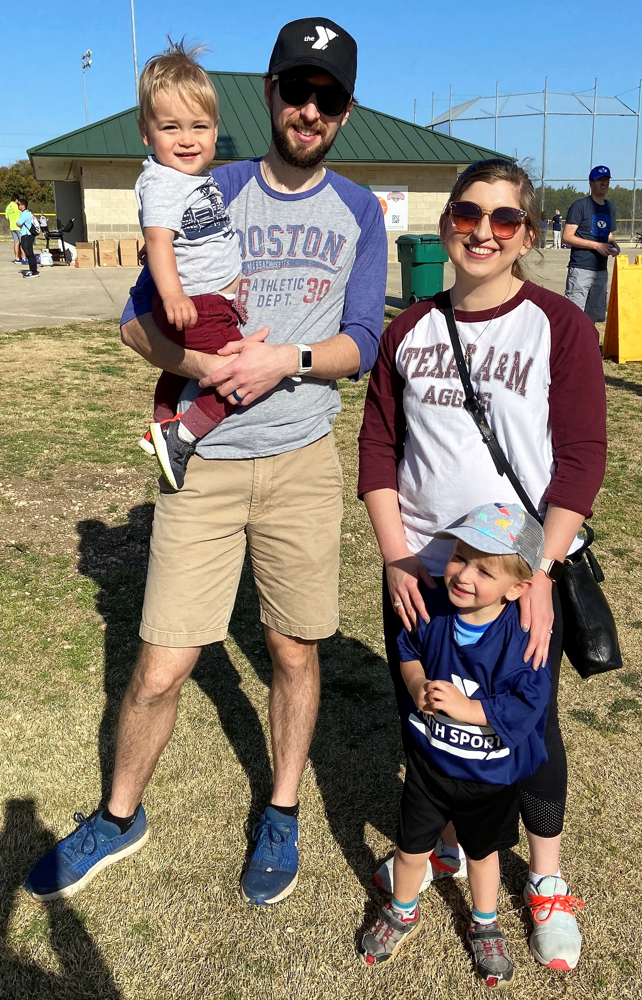
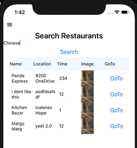
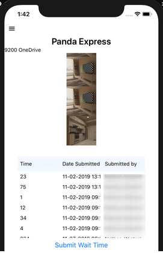
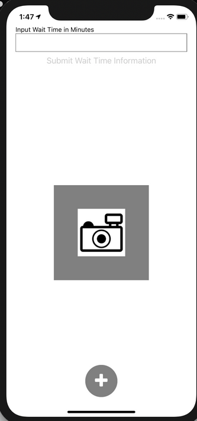
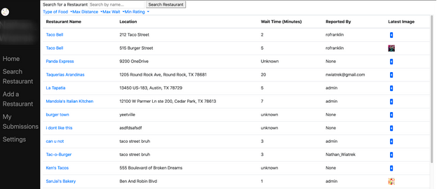
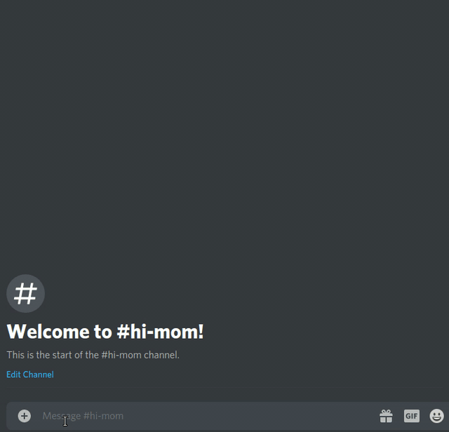
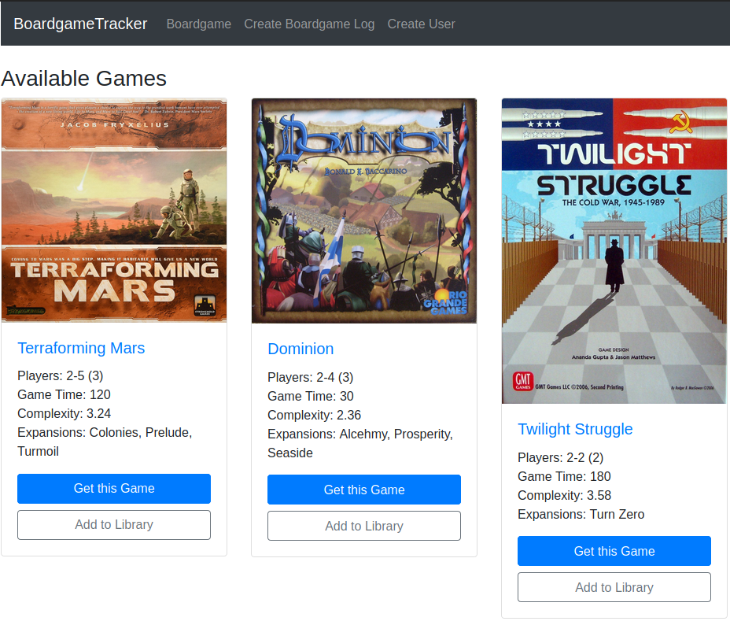
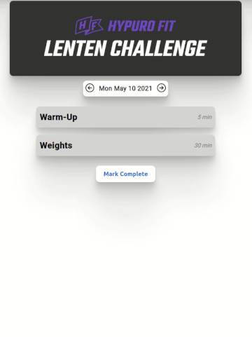

## Ben Musil - Experience and Bio
Thank you for stopping by! My name is Ben and I am married and father to two boys. I was born and raised in Austin, Texas and currently reside San Antonio! I graduated from Texas A&M with a B.S. in Mechanical Engineering and a minor in Computer Science. I also took a few graduate-level courses in Software Engineering at the University of Texas. I am currently a full-stack software engineer working remotely full-time. I have steered my career to software engineering through further education, taking on more responsibilities at work, and pursuing personal projects to practice those skills.

## [Link to my GitHub](https://github.com/benjamin-musil/)

**Table of Contents**
- [Statement of Purpose and Goals](#statement-of-purpose-and-goals)
- [Skills](#skills)
- [Employment](#employment)
- [Education](#education)
- [Projects](#projects)
- [Personal Life and Interests](#personal-life-and-interests)

## Statement of Purpose
I am seeking a full-stack or front-end position in web development within an Agile environment with specialization in React and opportunities in Node or .Net. 

## Skills
In the [Projects](#projects) section below I denote what technologies I used with each project. As a complete summary of tools and languages I've used, please see the list below:

### Web: 

- React, AngularJS, Vue
- SCSS, CSS Modules, Less 
- Node, .Net Core and Framwork, Flask, Express
- Azure tools including Web Jobs, App Services, Logic Apps, Service Busses, and others

### Other Platforms: 

- **Mobile**: React Native, Android SDK
- **Desktop**: WPF Apps, LabWindows CVI

### Databases: 

- MS SQL Server, MongoDB, PostgreSQL

### Tools and Languages: 

- TeamCity Deployers, Postman, Balsamiq, SonarQube, NUnit, Git, JIRA, Trello
- Javascript (ES5, ES6+), TypeScript, C#, Python, Java/Kotlin
- Nunit, Jest

### Environments: 
- Visual Studio, Visual Studio Code, IntelliJ, LabWindows CVI
- Windows, Ubuntu, Lubuntu, Arch Linux

## Employment
### **[Printing For Less](https://www.pfl.com/)** — *Software Engineer (Sep 2020 - Present)*

[Hybrid Experience](https://www.pfl.com/platform/) (Apr 2021 - Present)

[Tactile Marketing Automation - SwagIQ](https://appexchange.salesforce.com/appxListingDetail?listingId=a0N30000000pvn6EAA) (Sep 2021 - Apr 2021)

[Personal Marketing Center](https://www.pfl.com/personal-marketing-center/) (Sep 2020 - Sep 2021)

- Built a modern, consumer-facing front-end for an existing multi-million dollar tactile marketing automation Salesforce platform using React, TypeScript, SCSS, and CSS modules.
- Modified multiple existing marketing software products using Liquid templates, Vue, AngularJS, and C# and injected new features and pages using React.
- Translated mockups and designs from Figma to code and collaborated with designers on features.
- Wrote a RESTful web application to import assets into an internal system from a 3rd party content marketing platform with React and C#.
- Designed schemas and wrote queries for MS SQL Server.
- Wrote unit-tests in C# with NUnit and in React with Jest.
- Documented how-to articles in Confluence for team members onboarding to the project and wrote release notes for internal documentation.
- Hosted technical interviews for interns and full-time developers.
- Communicated updates to development tasks with product managers using JIRA and Scrum agile process.

### **[The Catholic Woodworker](https://catholicwoodworker.com/)** - *Website and Production Developer, Contractor (Jun 2020 - Sep 2020)*
- Wrote a RESTful Node application that fetched targeted cells in AirTable (cloud spreadsheet-database hybrid) and interacted with a third-party Shopify app to automatically populate custom product options including product design logic. 
- Created database tables in AirTable for managing part and product stock levels and website assets.
- The page has been updated since I worked on it, but it's about the same in essence still ([Link to the custom product page](https://catholicwoodworker.com/products/custom-rosary-designer))

### **[Applied Materials](http://www.appliedmaterials.com/)** — *Test Engineer II  (Jan 2018 - Jun 2020)*
- Wrote front-end components and data layers to communicate with our SQL database using C# and XAML with Visual Studio for a company-wide software application to test hardware products.
- Designed software interfaces using National Instrument’s IDE, LabWindows CVI, for use by technicians to test a variety of hardware products. I also developed the back-end functionality for the interfaces with C to communicate with data acquisition devices and run series of hardware tests with pass/fail criteria.
- Deployed software and hardware updates to test racks both on-site locally and at third party vendor sites that had Applied Materials test equipment. I tested real-life manufacturing conditions in the software and hardware before training and handing ownership to the local team.
- Designed and wrote virtual test debugging suites inside software legacy platform packages to be able to test without real hardware.
- Set up and debugged on test environments for in-house hardware test automation software with network computers.
- Wrote manual regression test checklists per project when a hardware or software change was added.

## Education
**Texas A&M University** — *B.S. Mechanical Engineering, Minor in Computer Science (Dec 2017)*

Graduate-level courses taken from the **University of Texas** *(Aug 2019 - May 2020)*
- *Advanced Programming Tools* - Covered several popular frameworks and tools including React Native, Docker, Jenkins, and NoSQL. Semester project details for a full-stack webapp are shared below in [Projects](#projects).
- *Software Testing* - Built a code coverage tool in Java from scratch that could be deployed to any existing Java project.
- *Machine Learning* - As part of a project to predict winners of college football games based on team averages and play-by-play game progress, I wrote models for results of running plays and tested accuracies between using methods like XGBoost, RandomForest, and GaussianNB.

## Projects 
***[Here is a link to all my public repositries on GitHub](https://github.com/benjamin-musil)***

### **[Line Picker](https://github.com/benjamin-musil/line-picker-webapp)** - 2019
*Mobile and Web App - React Native, Android SDK, MongoDB, Flask, Firebase*

Uses crowdsourced data to find out wait times of nearby restaurants based on category of food, distance to user, favorite category set by user, and other similar criteria. Users can submit wait times for specific restaurants with a picture to show the activity of the restaurant. Users also have the ability to add restaurants and check previous post history.

I worked with three other developers on this multi-platform app. Flask supported the app's back-end. The Android app front-end was written natively using Android SDK and refactored to include iOS compatibility with React Native. 

I wrote the interactions and links between Flask and MongoDB for data storage and filtering data. I used the Google Maps API for location services and Android/iOS camera APIs for capturing images and storing those images to local storage.

Please excuse the rough screenshots below, the focus for this project was on the back-end functionality. Video demo also here: [link to Line Picker Video Demo](https://drive.google.com/file/d/1E76dvm5gVsbyI6b6QIEorLhQtL56bR8V/view?usp=sharing).

[Web app repository](https://github.com/benjamin-musil/line-picker-webapp) | [Native Android app repository](https://github.com/benjamin-musil/line-picker-android) | [React Native app repository](https://github.com/benjamin-musil/line-picker-react-native)

### **[IsThereAnyDeal Finder](https://github.com/adamdavies001/isthereanydeal-lookup)** - 2020
*Discord Bot - Node.js*

 Looks up active deals for PC games through the [IsThereAnyDeal](IsThereAnyDeal.com) API when the bot is pinged in a Discord server. Users can add sellers to ignore. A feature for a server-curated wishlist and automated notifications is in progress. I am actively developing this with another person. This was originally a bot for our own private server, but we are making it so that it can be used by the public. Potential for income through affiliate links, however we'd have to create our own web scraper or interact with other API tools per the agreement with IsThereAnyDeal's API usage.

I am writing the server-curated wishlist portion of the bot. I have refactored code to use an API endpoint once instead of multiple times. I updated the response to be able to return multiple games as well as give more info such as a cover image of the game and user reviews if they are available.

### **Boardgame Deals and Hub** - 2020 (*Shelved*)
*Web App - MERN stack*

Taking inspiration from [DekuDeals](DekuDeals.com), I want to make a modern price tracker for board games while providing tools for library management. [Boardgamegeek](Boardgamegeek.com) is a popular site for board game stats but I feel it's lacking when it comes to finding games on sale and the design is a bit noisy for my taste. Other sites also track board game prices, but I would like present data such as a user score, send notifications to users, and generate recommendations for each user. I also want to bridge the gap between physical and digital players, especially with the current times of social distancing, which means tracking standalone digital games and DLC for platforms such as Tabletop Simulator.

This project is still in the beginning stages I currently have a framework setup and I'm working on a front-end mock-up. I will likely port some code for the digital tracking from the IsThereAnyDeal bot above.

Planning to monetize through affiliate links so the repo is private at this moment. Will post screenshots as the project progresses.

### **Hypuro Fit Web App** - 2021 (In Progress)
*Web App - MERN stack*

Catholic physical and spritual fitness desktop and mobile application. In the design and planning phase with code frameworks and some UI pages in progress. Wireframes, schemas, and existing UI available on request.

[Link to the Hypuro Fit company website](https://www.hypurofit.org/)

## Personal Life and Interests
Hey, I'm not a developer 100% of the time either! I love my fair share of leisurely activity and spending time with family, friends, and strangers. If I didn't have to work, I would love to host and lead guided tours for parks around the country and even the world. There are so many national, state, and local parks across the country and not enough people take time away from being "plugged-in" to find peace of mind in nature! My favorite parks I have visited are the Yosemite, Big Bend, and Rocky Mountain National Parks. Other outdoor activities I enjoy are basketball, tennis, and running.

Aside from that, I am the barista dad at home. I started my coffee journey with really awful big-batch coffee at a job but I evolved through grinding my own beans for custom Keurig cups, using a french press, and finally graduated to the beloved espresso machine. My normal go-to is an Americano because I love to taste the beans and not the flavor of milk or additives distract from the beans.

With that caffeine, I enjoy reading all types of books and discussing philosophy and theology. I am Catholic and I welcome respectful dialog with people of other viewpoints and I enjoy meaningful engagement with people of all walks of life. My favorite fictional series is Lord of the Rings (I can't tell you how awesome the audiobooks are by Rob Inglis) and I often have a rotation of 4 or 5 fictional and non-fictional books. Come share a local craft beer with me and we can talk about all sorts of books and movies!

Speaking of movies, I'm a Nicolas Cage afficiando and I even hosted a Nic Cage Friday weekly event in my freshman dorm in college. My favorite Cage movie is Face/Off because you get both a good movie and an insane Nicolas Cage. Travolta is a bonus because he is basically a Nicolas Cage clone in that movie.

I'm also a gamer at heart, both board games and video games. I have a large bookshelf dedicated to games such as Catan, Dominion, Carcassonne, King of Tokyo, Elder Sign, and many others. For video games, I'm primarily on PC but I play just about anything from retro or modern, indie or AAA. With older games I love finding community support such as the [OpenRCT2](https://openrct2.org/) project for Chris Sawyer's Roller Coaster Tycoon. I've even hosted game servers for 7 Days to Die and Roller Coaster Tycoon using my 2012 Thinkpad (which I still use time to time).
