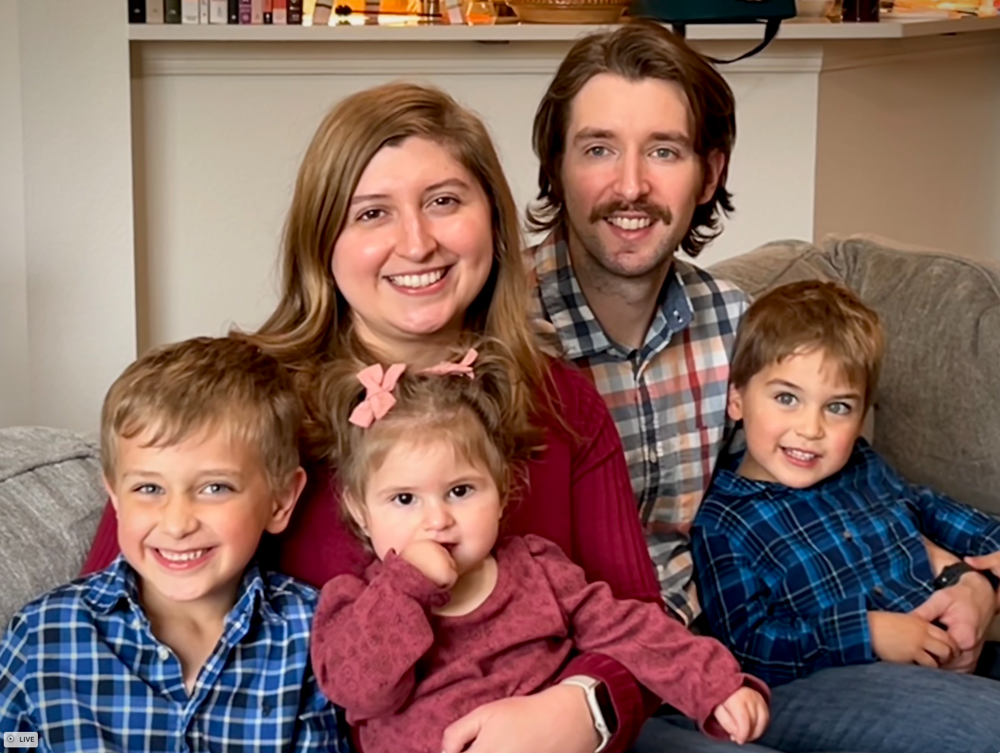

## Ben Musil - Experience and Bio
Thank you for stopping by! My name is Ben and I am married and father to three children. I was born and raised in Austin, Texas and currently reside there after a brief stint in Montana! I graduated from Texas A&M with a B.S. in Mechanical Engineering and a minor in Computer Science. I also took a few graduate-level courses in Software Engineering at the University of Texas. I am currently a front-end software engineer working remotely full-time. I have steered my career to software engineering through further education, taking on more responsibilities at work, and pursuing personal projects to practice those skills.

#### [Link to my GitHub](https://github.com/benjamin-musil/)

**Table of Contents**
- [Statement of Purpose and Goals](#statement-of-purpose-and-goals)
- [Education](#education)
- [Skills](#skills)
- [Employment](#employment)
- [Personal Life and Interests](#personal-life-and-interests)

## Statement of Purpose
I am seeking a full-stack or front-end position in web development within an Agile environment with specialization in React and opportunities in Node or similar technologies. 

## Education
**Texas A&M University** — *B.S. Mechanical Engineering, Minor in Computer Science (Dec 2017)*

**University of Texas** - Graduate-level courses *(Aug 2019 - May 2020)*
- *Advanced Programming Tools* - Covered several popular frameworks and tools including React Native, Docker, Jenkins, and NoSQL. Wrote a global map finder feature using React Native, MongoDB, Flask, and Google Maps API.
- *Software Testing* - Built a code coverage tool in Java from scratch that could be deployed to any existing Java project.
- *Machine Learning* - As part of a project to predict winners of college football games based on team averages and play-by-play game progress, I wrote models for results of running plays and tested accuracies between using methods like XGBoost, RandomForest, and GaussianNB.

## Skills
In the [Projects](#projects) section below I denote what technologies I used with each project. As a complete summary of tools and languages I've used, please see the list below:

### Web Technologies: 

- React, AngularJS, Vue
- SCSS, CSS Modules, Tailwind, Less
- Node, .NET, Flask, Express
- Azure tools including Web Jobs, App Services, Logic Apps, Service Busses, and others

### React State Management:

- Zustand, Mobx, Tanstack Query

### UI Libraries:

- Material UI, Mantine, Tailwind

### Other Platforms: 

- **Mobile**: React Native, Android SDK
- **Desktop**: WPF Apps, LabWindows CVI

### Databases: 

- PostgreSQL, MS SQL Server, MongoDB

### Tools and Languages: 

- TeamCity Deployers, Postman, Balsamiq, SonarQube
- Git, Github, Gitlab, Bitbucket
- JIRA, Notion, Asana, Trello
- Javascript (ES5, ES6+), TypeScript, C#, Python, Java/Kotlin
- Nunit, Jest
- Storybook
- Docker
- Eslint, Husky, Stylelint
- REST, GraphQL

### Environments: 
- Visual Studio, Visual Studio Code, IntelliJ, LabWindows CVI
- MacOS, Windows, Ubuntu, Lubuntu, Arch Linux

## Employment
### **[Called](https://www.called.app/)** — *Senior Frontend Engineer (Apr 2023 - Present)*

#### Projects

[Called Web App](https://web.called.app) - Chat platform for churches

[Called Invite App](https://invite.called.app/)

#### Responsibilities

- Prototyped and implemented core front-end features for a chat platform, including the chat interface, a CRM user table with paginated views and dynamic member panels, and event and news views. 
- Developed robust state management solutions using Zustand and integrated Material-UI (MUI) for efficient UI rendering.
- Built a responsive React web application for user invites and sign-ups, integrating Firebase authentication for email/password, phone/OTP, and social logins (Google, Apple) with seamless user experiences on mobile and desktop platforms.
- Enhanced team productivity and code quality by introducing Husky hooks, configuring ESLint, and writing tests with vitest.
- Supported collaboration with UX designers using Figma and streamlined project planning with Notion, setting up automations for agile metrics tracking and visualization.

### **[Printing For Less](https://www.pfl.com/)** — *Senior Software Engineer (Sep 2020 - Apr 2023)*

#### Projects
[Hybrid Experience](https://www.pfl.com/platform/platform-overview)

[Tactile Marketing Automation - SwagIQ](https://appexchange.salesforce.com/appxListingDetail?listingId=a0N30000000pvn6EAA)

[Personal Marketing Center](https://www.pfl.com/personal-marketing-center/)

#### Responsibilities

- Built a modern, consumer-facing front-end for an existing multi-million dollar tactile marketing automation Salesforce platform using React, TypeScript, SCSS, and CSS modules. (SwaqIQ)
- Migrated existing client-side queries from REST to GraphQL with the Apollo GraphQL client.
- Contributed to a company-wide component library in React to based in Mantine to reuse common web components across multiple codebases and exposed Storybook for QA and Design teams.
- Modified multiple existing marketing software products using Liquid templates, Vue, AngularJS, and C# and injected new features and pages using React.
- Translated mockups and designs from Figma and Miro to code and collaborated with designers on features.
- Wrote a RESTful web application to import assets into an internal system from a 3rd party content marketing platform with React and C#.
- Wrote unit-tests in React with Jest
- Documented how-to articles in Confluence for team members onboarding to the project and wrote release notes for internal documentation.
- Communicated updates to development tasks with product managers using JIRA and Scrum agile process.

### **[The Catholic Woodworker](https://catholicwoodworker.com/)** - *Website and Production Developer, Contractor (Jun 2020 - Sep 2020)*
- Wrote a RESTful Node application that fetched targeted cells in AirTable (cloud spreadsheet-database hybrid) and interacted with a third-party Shopify app to automatically populate custom product options including product design logic. 
- Created database tables in AirTable for managing part and product stock levels and website assets.
- The page has been updated visually since I worked on it, but it's about the same in functionality still ([Link to the custom product page](https://catholicwoodworker.com/products/custom-rosary-designer))

### **[Applied Materials](http://www.appliedmaterials.com/)** — *Test Engineer II  (Jan 2018 - Jun 2020)*
- Wrote front-end components and data layers to communicate with our SQL database using C# and XAML with Visual Studio for a company-wide software application to test hardware products.
- Designed software interfaces using National Instrument’s IDE, LabWindows CVI, for use by technicians to test a variety of hardware products. I also developed the back-end functionality for the interfaces with C to communicate with data acquisition devices and run series of hardware tests with pass/fail criteria.
- Deployed software and hardware updates to test racks both on-site locally and at third party vendor sites that had Applied Materials test equipment. I tested real-life manufacturing conditions in the software and hardware before training and handing ownership to the local team.
- Designed and wrote virtual test debugging suites inside software legacy platform packages to be able to test without real hardware.
- Set up and debugged on test environments for in-house hardware test automation software with network computers.
- Wrote manual regression test checklists per project when a hardware or software change was added.

## Personal Life and Interests
Hey, I'm not a developer 100% of the time either! I love my fair share of leisurely activity and spending time with family, friends, and strangers. If I didn't have to work, I would love to host and lead guided tours for parks around the country and even the world. There are so many national, state, and local parks across the country and not enough people take time away from being "plugged-in" to find peace of mind in nature! My favorite parks I have visited are the Yosemite, Big Bend, and Rocky Mountain National Parks. Other outdoor activities I enjoy are basketball, tennis, and running.

Aside from that, I am the barista dad at home. I started my coffee journey with really awful big-batch coffee at a job but I evolved through grinding my own beans for custom Keurig cups, using a french press, and finally graduated to the beloved espresso machine. My normal go-to is an Americano.

With that caffeine, I enjoy reading all types of books and discussing philosophy and theology. I am Catholic and I welcome respectful dialog with people of other viewpoints and I enjoy meaningful engagement with people of all walks of life. My favorite fictional series is Lord of the Rings (I can't tell you how awesome the audiobooks are by Rob Inglis) and I often have a rotation of 4 or 5 fictional and non-fictional books. Come share a local craft beer with me and we can talk about all sorts of books and movies!

Speaking of movies, I'm a Nicolas Cage afficiando and I even hosted a Nic Cage Friday weekly event in my freshman dorm in college. My favorite Cage movie is Face/Off because you get both a good movie and an insane Nicolas Cage. Travolta is a bonus because he is basically a Nicolas Cage clone in that movie.

I'm also a gamer at heart, both board games and video games. I have a large bookshelf dedicated to games such as Catan, Dominion, Carcassonne, King of Tokyo, Elder Sign, and many others. For video games, I'm primarily on PC but I play just about anything from retro or modern, indie or AAA. With older games I love finding community support such as the [OpenRCT2](https://openrct2.org/) project for Chris Sawyer's Roller Coaster Tycoon. I've even hosted game servers for 7 Days to Die and Roller Coaster Tycoon using my 2012 Thinkpad (which I still use time to time).
